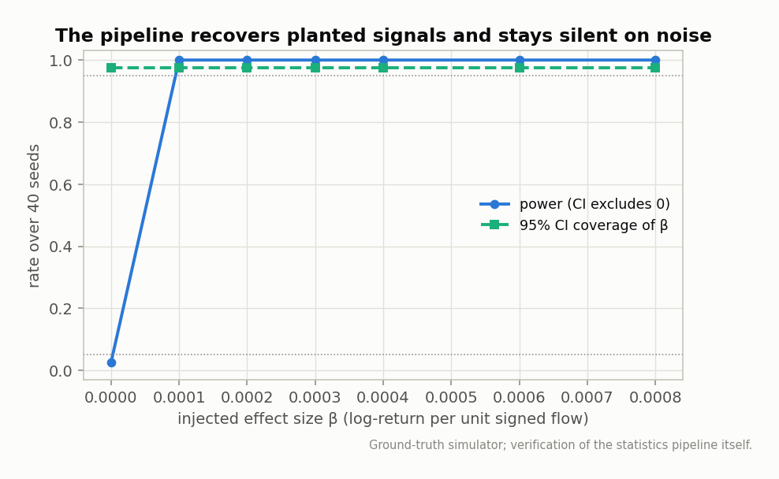
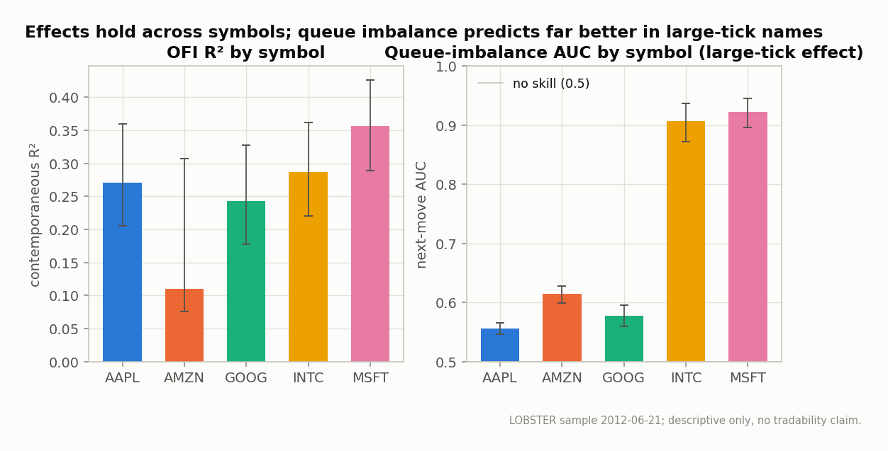
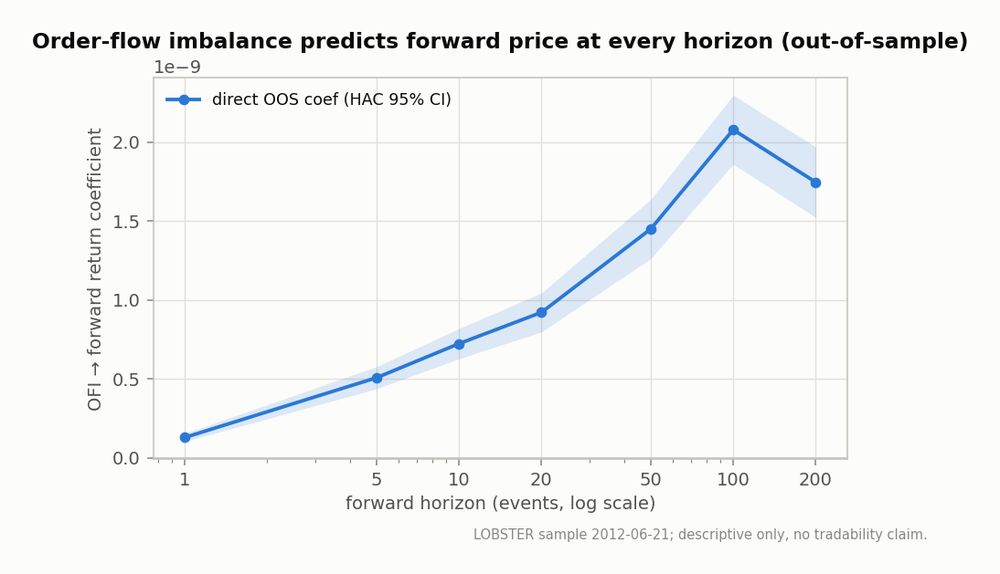
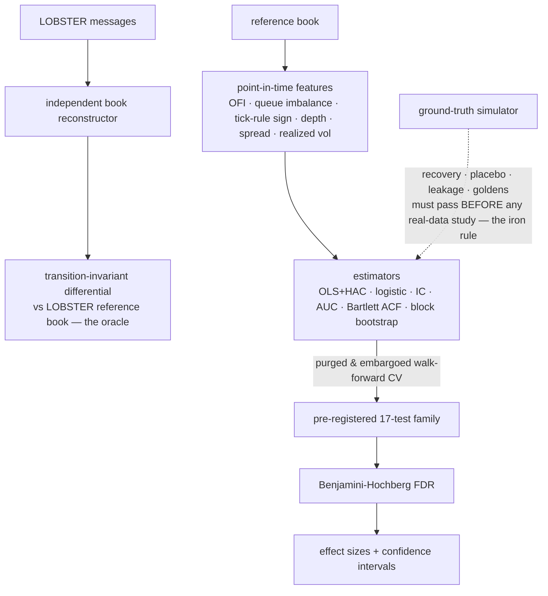

# micro-lab

[](https://github.com/billdmar/micro-lab/actions/workflows/ci.yml)
[](https://www.python.org/)
[](#verification-the-point-of-the-project)
[](LICENSE)

**A market-microstructure research platform that reconstructs NASDAQ limit order books from
LOBSTER data and replicates canonical order-flow results — order-flow imbalance, queue-imbalance
prediction, trade-sign long memory, price impact — with honest statistics (HAC errors, purged
walk-forward CV, FDR control, confidence intervals on every effect).** Its distinguishing feature
is that the statistics pipeline was **verified against a ground-truth-injectable simulator** — it
recovers planted signals and stays silent on noise — *before* it touched real data.

> This project reports **effect sizes with confidence intervals under multiple-testing control,
> and nothing more**. There are no PnL, strategy, tradability, or forecasting claims anywhere —
> the measured effects are real but small and cost-dominated, and the research note says so
> plainly. Descriptive microstructure research, not investment advice.

## Headline

*In one line: reconstruction is provably exact against an external oracle; the statistics pipeline
provably recovers planted signals and stays silent on noise; and the replicated effects are real,
small, and cost-dominated — every one reported with a confidence interval under FDR control.*

| Metric | Value |
|---|---|
| LOBSTER events processed | **2,110,860** (AAPL · AMZN · GOOG · INTC · MSFT, 2012-06-21, level 10) |
| Reconstruction correctness oracle | **100.0000%** exact per-event transition invariant — **0 violations / 1,673,089 transitions**¹ |
| Pipeline verification | injected β recovered within **0.05%**, **97.5%** CI coverage (40 seeds), power rises to **100%**; placebo FPR **2.5%** |
| OFI → contemporaneous price | HAC slope = **5.8e-9** (p ≈ 1e-192); R² = **0.150** [0.120, 0.186] as a descriptive fit (Cont–Kukanov–Stoikov) |
| OFI → forward price | **positive & FDR-significant at every horizon** (direct out-of-sample coef, per-symbol purged walk-forward CV); coef is return-per-unit-OFI, so small by construction, rising **1.3e-10** (h=1) → **~2.1e-9** (h=100) |
| Queue imbalance → next move | AUC = **0.637** [0.617, 0.658]; **0.91–0.92 in large-tick names**² (Gould–Bonart) |
| Trade-sign long memory | ρ decays **0.764 → ~0** over lags 1–200 (Bouchaud) |
| Price impact | concave, log-log exponent **0.026** [0.005, 0.046] |
| Registered study family | **17 tests**, pre-registered; **15 FDR-significant** at α = 0.05 |
| Test coverage / determinism | **≥90% (CI-gated), ~97%** on CI, 160+ tests; every statistic & figure reproduces bit-for-bit |

*¹ The free LOBSTER level-10 sample is level-restricted, so a full-depth message-only book match is
structurally impossible; the exact per-event price-level transition invariant is the valid
correctness oracle and it holds at 100%. See [`docs/DESIGN.md §D1.1`](docs/DESIGN.md).*

*² Large-tick names (INTC ~$28, MSFT ~$31 — spread pinned to one tick) vs high-price names
(AAPL ~$586, GOOG ~$580): AUC 0.907/0.923 vs 0.556/0.578, with AMZN ~$224 mid-regime at 0.614 —
the canonical tick-size signature.*

## Showcase





## How it works



Contracts (`src/schema.py`, `src/interfaces.py`) and the pre-registration
(`config/registry.py`: every alpha, tolerance, horizon, and the study family, each justified) were
frozen before the machinery was built. Every methodological choice is logged in
[`docs/DESIGN.md`](docs/DESIGN.md); the full results write-up is in
[`docs/RESEARCH_NOTE.md`](docs/RESEARCH_NOTE.md).

## Verification (the point of the project)

1. **Reconstruction oracle** — the exact per-event price-level transition invariant (submit,
   cancel, delete, execution) vs LOBSTER's own book: **100%, 0 violations / 1,673,089
   transitions**, tolerance 0. The full-depth message-only match rate is reported honestly as a
   data-limitation figure, never target-matched (`DESIGN §D1.1`).
2. **Synthetic recovery** — a ground-truth-injectable simulator; the pipeline recovers the
   injected β within **0.05%** with **97.5%** CI coverage and power rising to **100%**.
3. **Placebo nulls** — β = 0 yields a **2.5%** false-positive rate, at/below nominal.
4. **Leakage detection** — constructed leaks (label overlap, future-timestamped features,
   un-embargoed boundaries) are each caught (`tests/test_cv_leakage.py`, `test_integration_g1.py`).
5. **Estimator goldens** — HAC vs statsmodels, AUC vs scikit-learn, IC vs scipy, Bartlett ACF vs
   statsmodels — all to **1e-8** on synthetic data.
6. **Multiple testing** — Benjamini-Hochberg across the whole 17-test family
   (`src/multi/fdr.py`, golden-matched to statsmodels; empirical FDR ≤ α verified).
7. **Determinism** — everything seeded from one master seed; `runner`, `g1_gate`, and every figure
   regenerate byte-identically. The **alpha/tolerance registry** holds every threshold with a
   written justification, never widened to force a pass.

## Quickstart

```bash
python3.12 -m venv .venv && source .venv/bin/activate
pip install -e ".[dev]"                  # or: make install

make verify                              # ruff + format-check + CI test subset + ≥90% coverage gate
# or run the pieces directly:
python -m pytest -m "not slow"           # verification suite (CI subset), ~97% coverage

# reproduce everything (needs the LOBSTER sample):
make data                                # download the sample (not committed)
make gate                                # print the machinery-gate evidence (python -m src.studies.g1_gate)
make studies                             # rerun the 17-test family -> data/fixtures/*.csv
make figures                             # regenerate docs/figures/*.png (deterministic)
python -m pytest                         # full suite incl. slow real-data checks
```

## Design highlights

- **Verified-machinery-first.** The iron rule: no real-data study runs until the pipeline has
  recovered planted signals, stayed silent on noise, and caught constructed leaks. "I tested my
  testing."
- **Point-in-time by construction.** Every feature declares its information timestamp; look-ahead
  is structurally impossible and enforced by leakage tests.
- **Honest claims.** Effect sizes with CIs, FDR-controlled, zero tradability language; surprising
  and null results (the small return-per-unit-OFI magnitudes, the lag-100 and lag-200
  non-rejections) are kept and discussed, never dropped.
- **Reproducible.** One documented command per published statistic; seeded determinism throughout.

## Documentation

- **[`docs/RESEARCH_NOTE.md`](docs/RESEARCH_NOTE.md)** — the ~10-page write-up: verification of the
  machinery first, then results with CIs, the literature comparison, the tick-size discussion, the
  transaction-cost caveat, and limitations.
- **[`docs/DESIGN.md`](docs/DESIGN.md)** — the methodology log: every non-trivial choice with its
  rationale and literature anchors.
- **[`docs/ENV.md`](docs/ENV.md)** — pinned toolchain and how to reproduce the environment.

## Data & attribution

Uses **LOBSTER** ([lobsterdata.com](https://lobsterdata.com)) limit-order-book sample data, which
reconstructs NASDAQ order books from TotalView-ITCH. Raw files are **not** redistributed here —
they are downloaded at build time by `scripts/get_data.sh` under LOBSTER's academic-use terms;
only small derived fixtures are committed. Please cite LOBSTER if you use the data. Provenance of
the exact sample used is in [`docs/DESIGN.md §D0.1`](docs/DESIGN.md).

## License

MIT (source code only — see [`LICENSE`](LICENSE), including the note on data).
